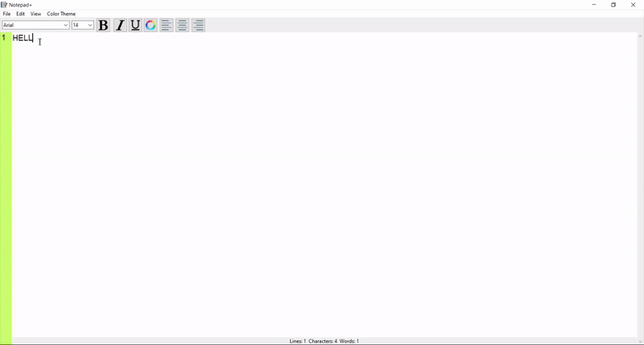

# Notepad+
It is a text editor written in python using Tkinter GUI interface.It is like other text editors with some additional features.

## Basic Features:
- File Menu
    - New File
    - Open
    - Save
    - Save As
    - Exit
- Edit Menu
    - copy
    - Paste
    - Cut
    - Clear All
    - Find and Replace

All the basic Features can also be called through shortcuts.

## **Additional Features:**
- **Various Color Themes**
- **Different font types**
- **Different font Sizes**
- **Bold Text**
- **Italic Text**
- **Underline text**
- **Allignments(RIGHT,CENTER,LEFT)**
- **Statusbar(show number of lines,charachters,words)**
- **Linebar(Show number of lines)**

- User can also checkout or checkin in the view menu to hide or to show any of the bar like toolbar,Line number bar,Statusbar.

# Demo

**Suggestions are most welcomed.**

**Give a ⭐ if you like it or if this repository helped you in any way.**

**Thank You..**
 
